## Individual Diagrams

### Slide 2: Traditional PINN vs Our Approach

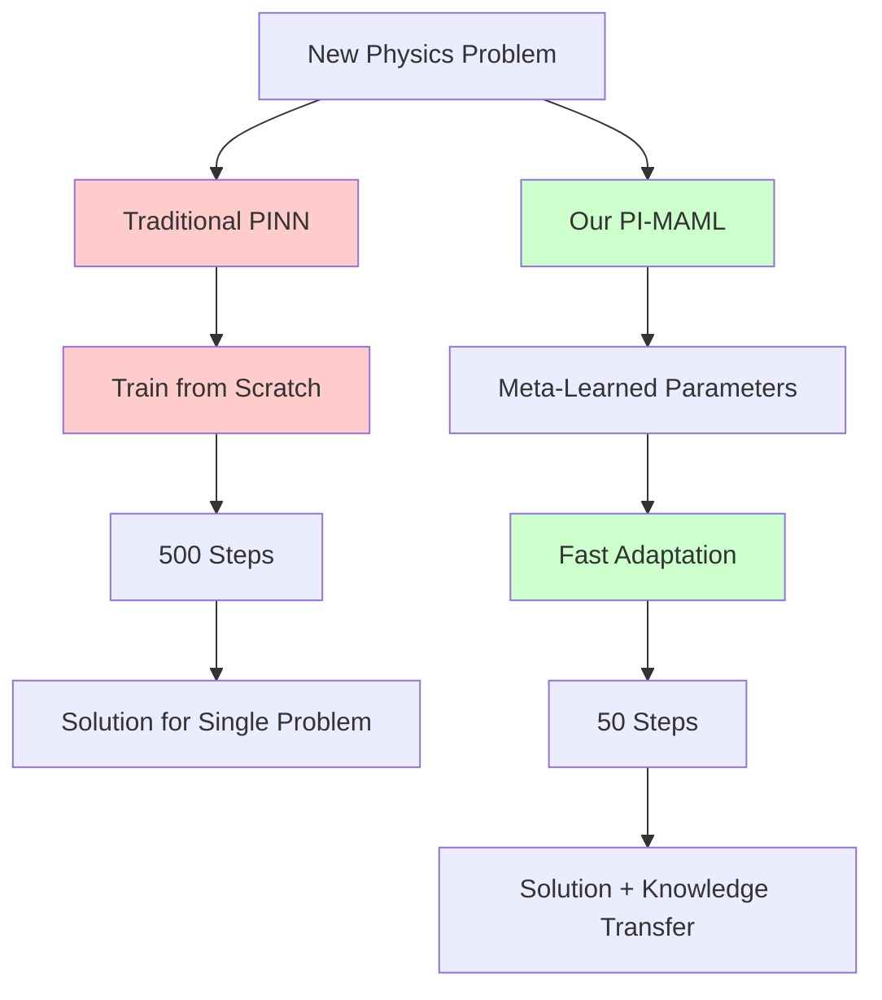

### Slide 3: Motivating Example - Fluid Dynamics

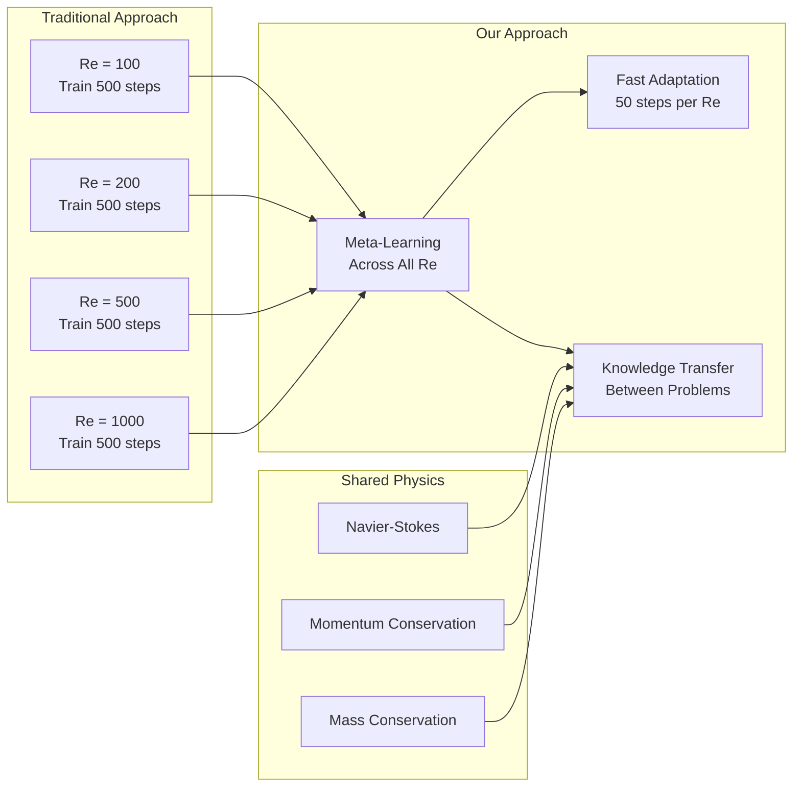

### Few-Shot Parameter Inference Explanation

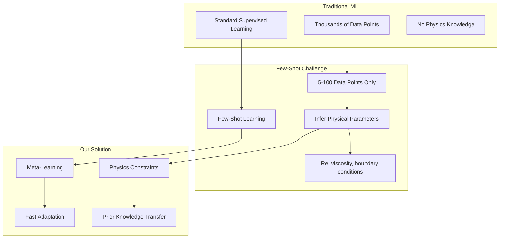

### Slide 4: Meta-Learning Concept

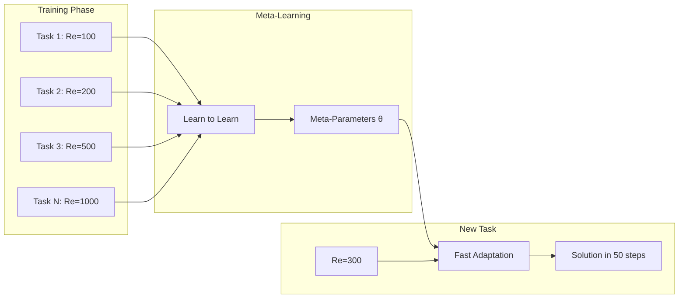

### Slide 5: Framework Overview

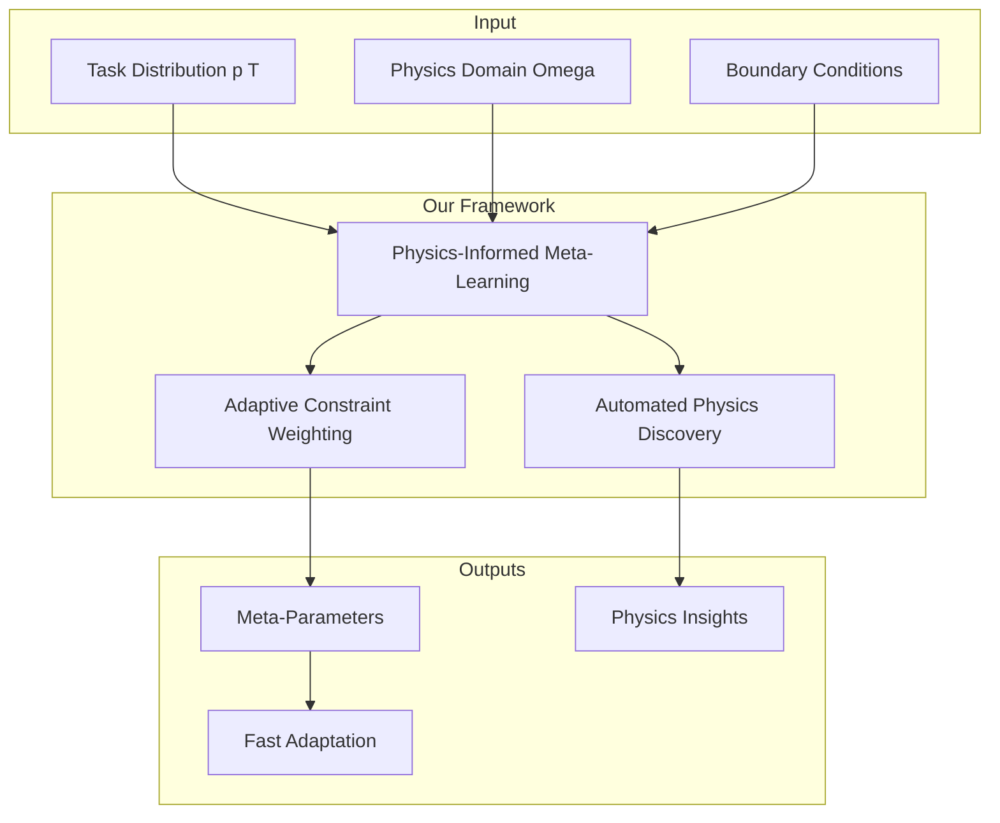

### Slide 6: Problem Formulation

```mermaid
graph TB
    subgraph "Task Ti"
        Domain[Domain Ωi ⊂ ℝᵈ]
        Boundary[Boundary ∂Ωi]
        PDE[PDE: Fi[ui](x) = 0]
        BC[BC: Bi[ui](x) = 0]
        Data[Data: Di = {(xj, uj)}]
    end
    
    subgraph "Task Distribution"
        T1[Task 1]
        T2[Task 2]
        TN[Task N]
    end
    
    subgraph "Meta-Learning Goal"
        MetaModel[Meta-Model θ]
        FastAdapt[Fast Adaptation φT]
        Physics[Respect Physics]
    end
    
    Domain --> PDE
    Boundary --> BC
    Data --> FastAdapt
    
    T1 --> MetaModel
    T2 --> MetaModel
    TN --> MetaModel
    
    MetaModel --> FastAdapt
    FastAdapt --> Physics
```

### Slide 7: Physics-Informed Meta-Learning Algorithm

```mermaid
graph TD
    Start[Initialize θ] --> SB[Sample Task Batch]
    SB --> IT[For each Task Ti]
    IT --> TE[Compute Task Embedding hTi]
    TE --> AW[Adaptive Weight λi = σ(WλhTi + bλ)]
    AW --> IP[Initialize φi = θ]
    IP --> IL[Inner Loop: K steps]
    
    subgraph "Inner Loop"
        CP[Sample Collocation Points]
        DL[Compute Data Loss]
        PL[Compute Physics Loss: |F[uφ]|²]
        TL[Total Loss: Ldata + λiLphysics]
        UP[Update: φi = φi - β∇φiLtotal]
    end
    
    IL --> CP
    CP --> DL
    DL --> PL
    PL --> TL
    TL --> UP
    UP --> QE[Evaluate on Query Set]
    QE --> MG[Compute Meta-Gradient]
    MG --> UM[Update Meta-Parameters θ]
    UM --> Conv{Converged?}
    Conv -->|No| SB
    Conv -->|Yes| End[Return θ, Wλ, bλ]
```

### Slide 8: Physics Loss Implementation

```mermaid
graph TB
    subgraph "Domain Ω"
        IP[Interior Points]
        BP[Boundary Points ∂Ω]
    end
    
    subgraph "Physics Loss"
        PDE[PDE Residual: |F[uφ](x)|²]
        BCs[Boundary Conditions: |B[uφ](x)|²]
        PL[Lphysics = E[PDE] + E[BCs]]
    end
    
    subgraph "Implementation"
        AD[Automatic Differentiation]
        CM[Collocation Method]
        MC[Monte Carlo Sampling]
    end
    
    IP --> PDE
    BP --> BCs
    PDE --> PL
    BCs --> PL
    PL --> AD
    AD --> CM
    CM --> MC
```

### Slide 9: Adaptive Constraint Weighting

```mermaid
graph LR
    subgraph "Task Characteristics"
        TC[Task Ti]
        GE[Geometry]
        PC[Physics Complexity]
        DP[Data Points]
    end
    
    subgraph "Task Encoder"
        NN[Neural Network]
        TE[Task Embedding hTi]
    end
    
    subgraph "Adaptive Weighting"
        AW[λ(T) = σ(WλhT + bλ)]
        Lambda[Physics Weight λi]
    end
    
    TC --> NN
    GE --> NN
    PC --> NN
    DP --> NN
    NN --> TE
    TE --> AW
    AW --> Lambda
```

### Slide 12: Experimental Setup Overview

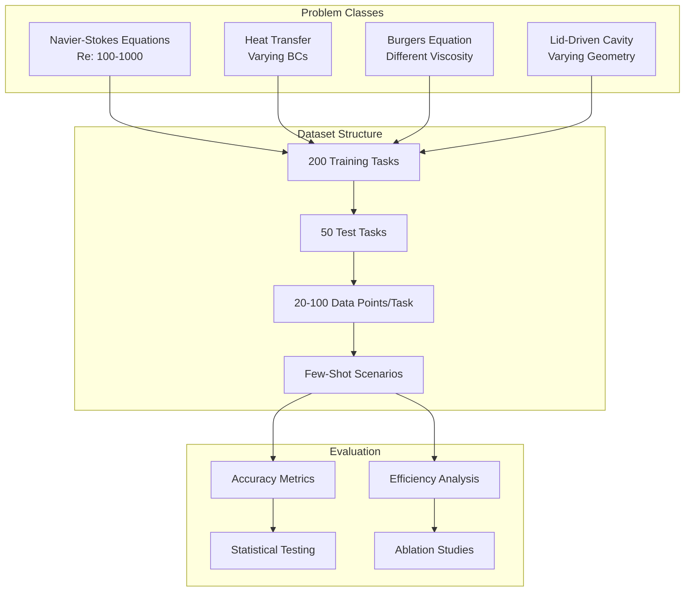

### Slide 20: Limitations - Domain Specificity

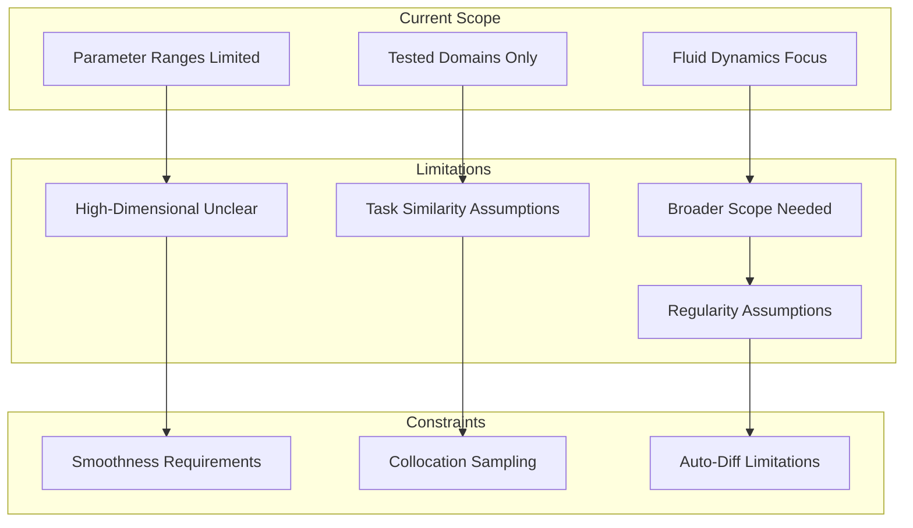

### Slide 21: Limitations - Theoretical Assumptions

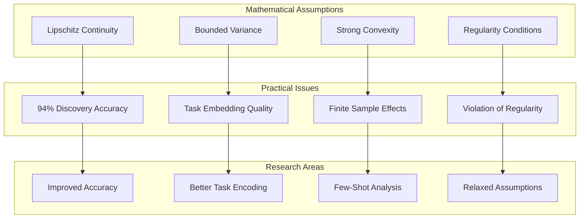

### Slide 22: Future Work - Broader Physics Domains

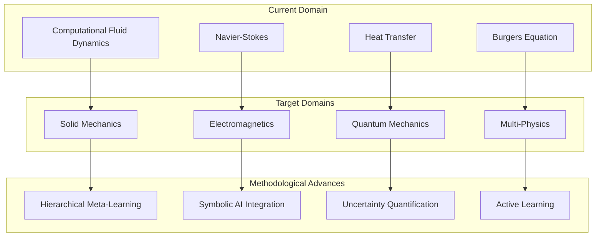

### Slide 23: Theoretical Extensions Roadmap

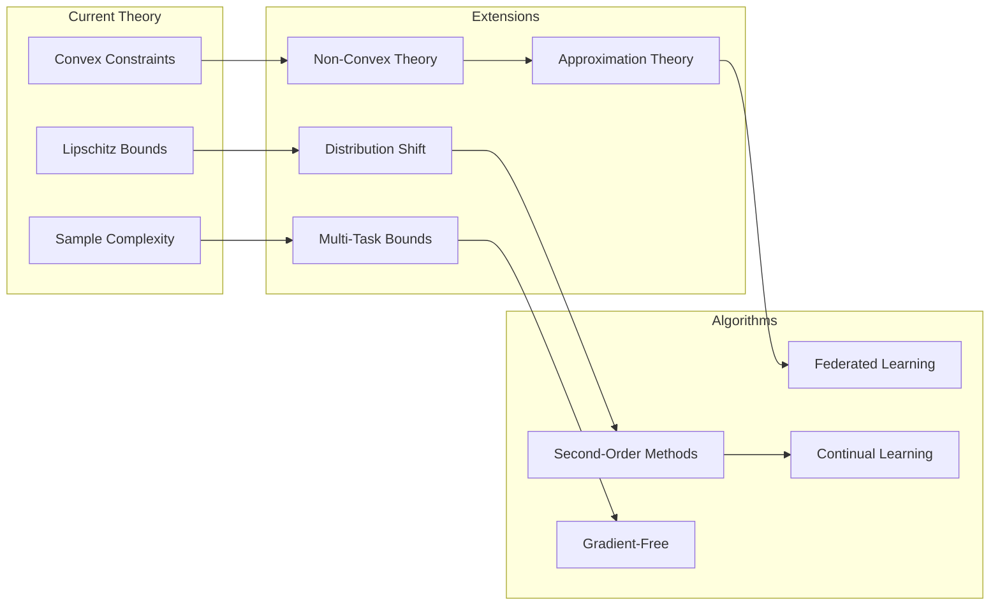

### Slide 24: Applications and Impact

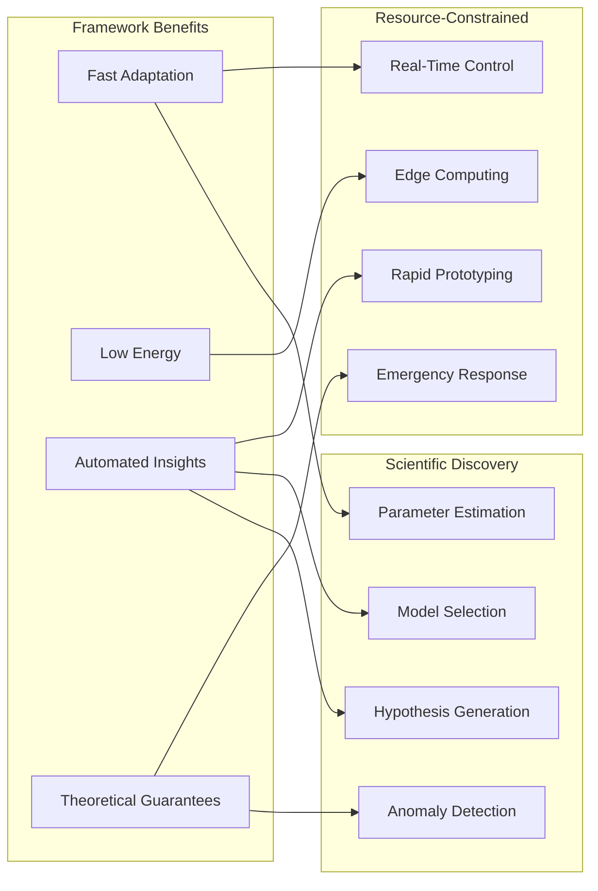

### Slide 25: Before/After Comparison

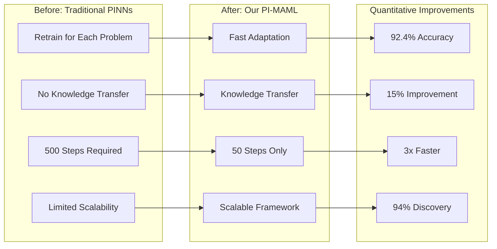

### Slide 26: Technical Contributions Summary

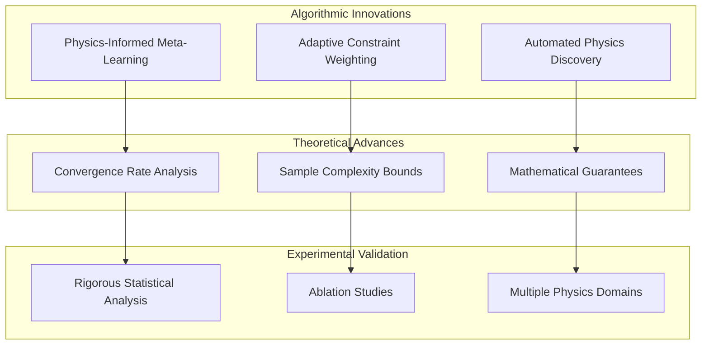

### Slide 27: Research Impact Visualization

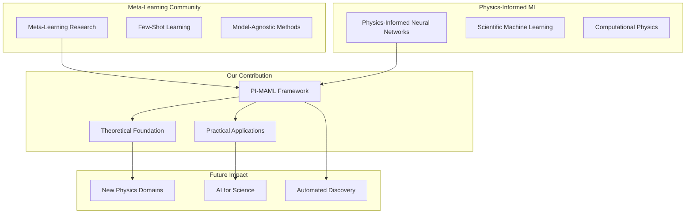
